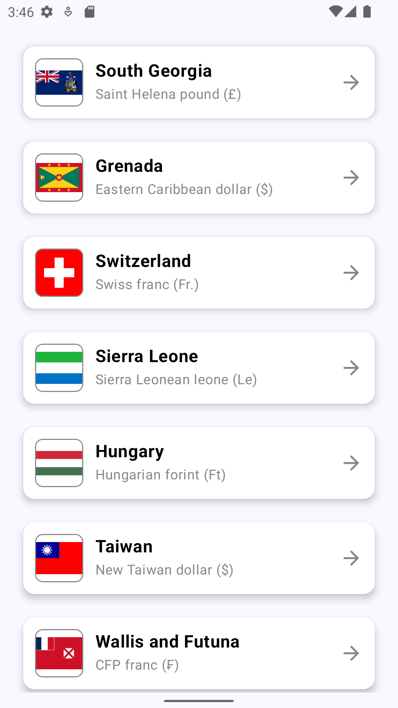
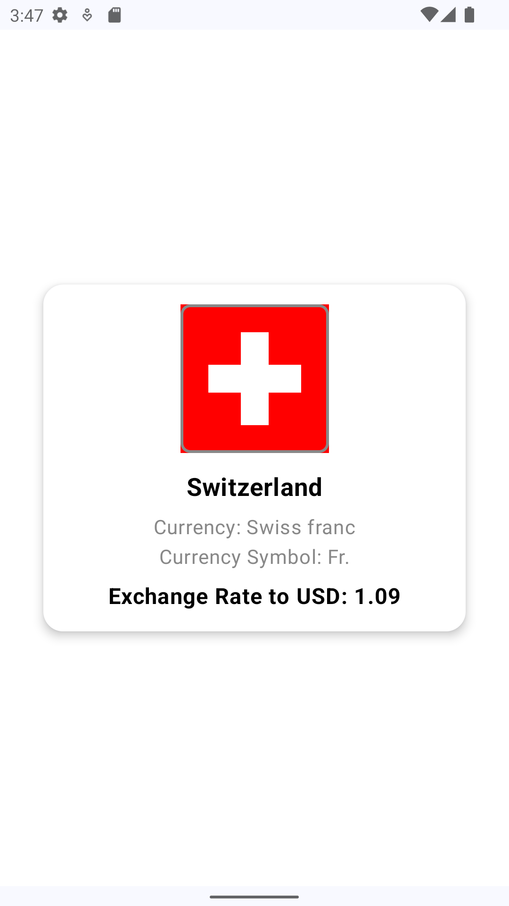
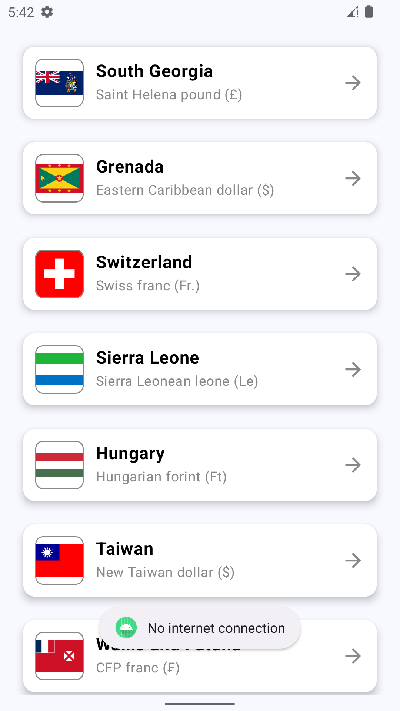

# Android Programming Test

## Objective
The goal of this challenge is to develop a simple Android application that displays a list of countries and their corresponding currency exchange rates to USD. The application should consist of two main screens:

### 1. Countries List Screen
- Display a list of all available countries.
- Each list item should include:
  - Country name
  - Country flag
  - Currency name
  - Currency symbol
- Tapping on an item should navigate to the second screen (Country Exchange Rates).
- Data source: [Countries and Currencies API](https://restcountries.com/v3.1/all)
- Not all countries have currency data available. Handle this case by displaying a placeholder message.

### 2. Country Exchange Rates Screen
- Display the exchange rate of the selected country's currency to USD.
- Data source: [Exchange Rate API](https://api.exchangerate-api.com/v4/latest/USD)
- Not all countries have exchange rate data available. Handle this case by displaying a placeholder message.

You are free to design the UI/UX, but the screens should include the elements mentioned above. The images below illustrate a basic layout concept (feel free to enhance it):


## Technical Requirements
- The app should be built using **Kotlin** and support Android API level 24 or higher.
- Use any libraries or tools you find suitable.

## Provided Resources
- The API for countries is already implemented using Retrofit. Refer to the following classes:
  - CountriesApi: Defines the API endpoints for fetching country data. 
  - CountriesService: The service layer for interacting with the country API. 
  - CountriesResponse: The data model for parsing the country API response. 

- For the exchange rate API, only the interface and response model are provided. Feel free to implement the necessary functionality:
  - ExchangeRateApi: Interface for the exchange rate API endpoints. 
  - ExchangeRateResponse: The data model for parsing the exchange rate API response.

## Quality Expectations
- Focus on clean code and good architecture. Quality is key.
- Document your design choices, including any trade-offs or compromises due to time constraints.
- If you encounter limitations or areas that could be improved with more time, please note them in a README file.

## Time Allocation
- We suggest spending around 2 to 4 hours on this task, depending on your experience level.
- If you find yourself exceeding 6 hours, consider whether you are adding unnecessary complexity.
- Include a summary of your work, explaining what was prioritized and any TODOs for future improvements.

## Submission
- Create a private Git repository from this template and invite the following users as collaborators:
  - `@mohamadjaara`
  - `@vitorhugods`
- Please ensure the repository remains private and do not share your solution publicly or with third parties.

Good luck! We look forward to seeing your implementation.

## Notes and Implementation Details
**Architecture Pattern**
For this project i used MVVM, I opted to use the Clean Architecture pattern, which helps to separate concerns, making the code more maintainable and testable. Clean Architecture divides the application into different layers:

**Presentation Layer – Contains the ViewModel and UI logic.**
Domain Layer – Holds business logic (use cases).
Data Layer – Responsible for data fetching and persistence (repositories and APIs).
The separation of concerns ensures that each layer only depends on the one directly below it, leading to a more modular structure and easier testing.

**Libraries and Tools**
Hilt: For dependency injection. This simplifies the creation and management of object dependencies across the application.
Kotlin Coroutines: Used to handle asynchronous operations smoothly, providing a better alternative to callback-based approaches.
Retrofit: For network communication with APIs. It simplifies API calls and response handling.
Mockk: A mocking framework used in unit testing to mock dependencies and simulate various behaviors during tests.
Kotlinx Serialization: Used to handle serialization and deserialization of JSON objects.
JUnit: For unit testing the ViewModel and repository layers, ensuring business logic and UI states are correct.
Truth: Used for assertions in your unit tests. It is a library for fluent assertions, allowing you to write clear and readable test expectations.
Lottie: Used for integrating Lottie animations in Jetpack Compose UI. This helps in rendering rich animations in your UI with Lottie files (e.g., JSON-based animations).

**Testing Strategy and Coverage**
Unit tests were written for repositories and ViewModels using JUnit and Mockk.
CountriesViewModel 100% Coverage
ExchangeRate 50% Coverage
ExchangeRateRepositoryImpl 100% Coverage

**Known Issues, Limitations, or Areas for Improvement**
**Error Handling:**
Currently, error handling in the repository is simplistic. More detailed error handling (e.g., handling specific API error codes) can be added to improve the user experience.

**Caching:**
The app does not implement caching for API responses. In real-world scenarios, caching is beneficial for improving app performance and reducing API calls, especially for countries

**Network Optimization:**
I added loading animation while getting data from API and also checking the network connection, I think we can do it more better using cashing.

**Testing Strategy:**
I implemented Repo testing, but we can do VM, UseCases and UI also. 

**Scalability:**
We can add Pagination, the data models may need to be optimized for performance (e.g., pagination, lazy loading, etc.).
We can also make module based approach for Countries and ExchangeRates.





// NOTE: The Countries API often returns STREAM ERROR, so for development and
// testing purposes, i am using a local JSON file (`countries.json`)
// instead of making actual network requests to the API. This ensures
// that the app remains functional while debugging or testing.
// CountriesScreen.kt
// ==============================================================
```kotlin
     val items = loadJsonFromAssets(context, "countries.json")
      ItemListScreen(items, context, onCountryClick)
```